# Radiologie Workflow Simulator (DICOM & HL7)

Dieses Projekt bietet eine komplette, einfach zu bedienende Simulationsumgebung, um Studierenden den digitalen Arbeitsablauf in der Radiologie (Workflow) näherzubringen.

## Features

- **KIS / LIS / RIS Simulation**: Patientenaufnahme (ADT), Laborprüfung (ORU), Auftrag (ORM) und Worklist-Generierung.
- **HL7 Analyse**: Visualisierung von Beispiel-Events (HL7 ADT / ORU / ORM) im Workflow.
- **Modalitäts-Simulation**:
  - **DICOM C-ECHO** (Verbindungstest ("Ping"))
  - **DICOM C-FIND** (Worklist-Abfrage)
    - **DICOM C-STORE** (Bild-Transfer zum PACS) inkl. Upload echter DICOM-Dateien (ZIP oder mehrere Dateien)
- **Workstation Simulation (Neu!)**:
  - **DICOM C-FIND (Study Root)**: Suche nach Studien im PACS.
  - **DICOM C-MOVE**: Anforderung von Bildern ("Retrieve").
  - **DICOM C-STORE (SCP)**: Empfang der angeforderten Bilder.
- **PACS (Orthanc)**: Echter, voll funktionsfähiger DICOM Server zur Bildspeicherung.
- **Generic DICOM**: Möglichkeit, echte, extern erzeugte DICOM-Dateien zu importieren.

## Architektur & Datenfluss

Folgendes Diagramm visualisiert die Kommunikationswege zwischen den simulierten Komponenten:

Arbeitsblatt für Lernende: [docs/arbeitsblatt-sus.md](docs/arbeitsblatt-sus.md)

Hinweis: Wenn Sie beim Preview die Meldung "No diagram type detected" sehen, wurde sehr wahrscheinlich die Mermaid-Preview auf die gesamte Markdown-Datei angewendet. Öffnen Sie stattdessen die Markdown-Vorschau (für `README.md`) oder nutzen Sie die reine Mermaid-Datei unter `docs/workflow.mermaid` (alternativ: `docs/workflow.mmd`).



Quelle (bearbeitbar): [docs/workflow.mermaid](docs/workflow.mermaid)

### Diagramm erklärt (Schritt für Schritt)

Das Diagramm zeigt, wie **administrative Daten** (Patient wird aufgenommen), **klinische Auftragsdaten** (CT wird beauftragt) und **Bilddaten** (DICOM) in der Radiologie zusammenlaufen.

**Legende (vereinfacht):**
- **HL7** = Textnachrichten zwischen Krankenhaus-IT-Systemen (KIS/LIS/RIS). Sie transportieren *Patientendaten*, *Aufträge* und *Laborbefunde*.
- **DICOM** = Protokolle/Dateiformat für radiologische Worklists und Bildübertragung (Modalität, Worklist, PACS, Workstation).
- **Worklist (MWL)** = eigener DICOM-Dienst (Termin-/Auftragsliste für Modalitäten), fachlich vom RIS getrieben.
- **PACS-Archiv** = DICOM-Archiv für Bilder/Studien (Query/Retrieve).
- **Wichtig:** In der Praxis können MWL und PACS im selben System laufen (hier: Orthanc), wir trennen es im Diagramm nur zur Erklärung.

#### 1) HL7 ADT: KIS → RIS (Patientendaten)
- **Was passiert fachlich?** Ein Patient wird im **KIS** administrativ aufgenommen/registriert.
- **Was passiert technisch?** Das KIS würde typischerweise eine **HL7 ADT**-Nachricht senden (z.B. A01 „Aufnahme“).
- **Warum ist das wichtig?** Das **RIS** hat dadurch korrekte Stammdaten (Name, PID usw.). Diese Daten sollen später automatisch in Auftrag, Worklist und DICOM-Metadaten landen.

#### 2) HL7 ORU: RIS ↔ LIS (Kreatinin prüfen)
- **Was passiert fachlich?** Vor einer CT mit Kontrastmittel muss die **Nierenfunktion** geprüft werden.
- **Was passiert technisch?** Das RIS fragt den Kreatininwert im **LIS** ab bzw. erhält einen Befund als **HL7 ORU** (Observation Result).
- **Wie wird das im Simulator veranschaulicht?** Im Dashboard kann man über **„🧪 LIS Abfragen (Kreatinin)“** einen (simulierten) ORU-Befund anzeigen lassen.
- **Was sollen SuS verstehen?** Medizinische Entscheidungen (Kontrastmittel ja/nein) hängen oft von Daten aus *anderen* Systemen (Labor) ab.

#### 3) HL7 ORM: RIS → Worklist-Server (MWL) (Auftrag freigeben)
- **Was passiert fachlich?** Das RIS erzeugt den Untersuchungsauftrag (z.B. „CT Abdomen mit KM“).
- **Was passiert technisch?** Üblich ist eine **HL7 ORM** (Order Message). In dieser Demo wird daraus ein **Worklist-Eintrag** erzeugt (als `.wl`), den die Modalität später abruft.
- **Merksatz:** **ADT = Patient**, **ORU = Labor**, **ORM = Auftrag**.

#### 4) DICOM C-FIND: Modalität → Worklist-Server (MWL) (Worklist abrufen)
- **Was passiert fachlich?** Der CT-Scanner „weiss“, welche Patient:innen heute dran sind.
- **Was passiert technisch?** Die **Modalität** sendet **DICOM C-FIND** gegen die *Modality Worklist*.
- **Ergebnis:** Die Modalität erhält Patient/Auftrag-Daten, ohne dass man sie am Gerät neu eintippen muss (Fehlervermeidung).

#### 5) DICOM C-STORE: Modalität → PACS-Archiv (Bilder senden)
- **Was passiert fachlich?** Der Scan wird durchgeführt, Bilddaten entstehen.
- **Was passiert technisch?** Die Modalität „pusht“ Bilder via **DICOM C-STORE** an das **PACS-Archiv** (hier: Orthanc).
- **Wichtig:** Die DICOM-Tags (PatientName/ID, AccessionNumber, StudyUID) sollten konsistent zu den vorherigen Schritten sein.

#### 6) DICOM C-FIND: Workstation ↔ PACS-Archiv (Studien suchen)
- **Was passiert fachlich?** Radiolog:innen suchen eine Studie im Archiv.
- **Was passiert technisch?** Die **Workstation** fragt das PACS per **DICOM C-FIND** (Study Root) nach Studien.
- **Ergebnis:** Eine Trefferliste mit Studieninformationen (z.B. Patient, Accession, StudyInstanceUID).

#### 7) DICOM C-MOVE: Workstation lädt Bilder aus dem PACS-Archiv
- **Was passiert fachlich?** Bilder werden zur Befundung geladen.
- **Was passiert technisch?** Die Workstation sendet **C-MOVE** (Retrieve-Anforderung). Danach sendet das PACS die Bilder in einem separaten Schritt per **C-STORE** an die Workstation zurück.
- **Lernpunkt:** „**Pull**“ (Workstation fordert an) führt trotzdem dazu, dass das PACS aktiv „**pushen**“ muss (C-STORE zurück zur Workstation).

Wenn Sie möchten, kann ich daraus auch eine kurze **1-Seiten-Zusammenfassung** (Arbeitsblatt) für den Unterricht machen.

## Voraussetzungen

- **Docker Desktop**: Muss installiert sein. (Download: [docker.com](https://www.docker.com/products/docker-desktop)).
- Sonst nichts! Keine komplexe Installation nötig.

## Schnellstart

### Windows
1. Doppelklick auf `start.bat`.
2. Warten Sie auf die Nachricht "Services started!".
3. Öffnen Sie Ihren Browser unter [http://localhost:5000](http://localhost:5000).

### Mac / Linux
1. Terminal öffnen.
2. `chmod +x start.sh` ausführen (nur einmalig nötig).
3. `./start.sh` ausführen.
4. Browser öffnen unter [http://localhost:5000](http://localhost:5000).

---

## Deployment (zentraler Server)

Anleitung: [docs/deploy-central-server.md](docs/deploy-central-server.md)

## Aufgabenbeschreibung für Lernende

Gehen Sie diese Schritte durch, um den Datenfluss im Krankenhaus zu verstehen:

### Aufgabe 0: Der Verbindungstest (C-ECHO)
*   **Aktion:** Klicken Sie auf der Hauptseite auf den grünen Button **"Verbindung testen (C-ECHO)"**.
*   **Beobachtung:** Sie sollten eine grüne Erfolgsmeldung erhalten.
*   **Hintergrund:**
    *   Der **DICOM Verification Service (C-ECHO)** ist das "Ping" der Medizinwelt.
    *   Er prüft, ob:
        1.  Das Netzwerk steht (TCP/IP).
        2.  Der Server läuft (Port offen).
        3.  Die DICOM-Konfiguration stimmt (AE-Titel akzeptiert).

### Aufgabe 1: Der Auftrag (KIS ➜ RIS & HL7)
*   **Ziel:** Verstehen, wie Patientendaten (KIS) mit Untersuchungsaufträgen (RIS) verknüpft werden.
*   **Aktion:** 
    1.  Öffnen Sie das Dashboard (simuliertes integriertes KIS/LIS/RIS).
    2.  Denken Sie sich einen neuen Patienten aus (z.B. `BOND^JAMES`, ID: `007`).
    3.  Achten Sie auf die **Accession Number (Auftragsnummer)** (z.B. `ACC001`). 
    4.  Klicken Sie auf **"RIS: Auftrag freigeben (HL7 ORM) + Worklist erstellen"**.
*   **Analyse (Hintergrund):**
    *   **Schritt 1 (KIS):** Die Registrierung des Patienten würde technisch ein **HL7 ADT** (Admission, Discharge, Transfer) Event auslösen.
    *   **Schritt 2 (RIS):** Die Beauftragung der Untersuchung erzeugt ein **HL7 ORM** (Order Management) Event.
    *   Ein typisches **HL7 ORM** Event sieht so aus (vgl. Anzeige im Simulator):
        ```
        MSH|^~\&|KIS|HOSPITAL|RIS|RADIO|20231010||ORM^O01|MSG01|P|2.3
        PID|||007||BOND^JAMES
        ORC|NW|ACC001
        OBR|1|ACC001||CT^CT Abdomen
        ```
    *   **Aufgabe:** Identifizieren Sie im Simulator die Segmente `PID` (Patient Identity) und `OBR` (Observation Request).

### Aufgabe 1b: Laborwerte prüfen (LIS & HL7 ORU)
*   **Ziel:** Verifizieren der Kontraindikationen (Nierenfunktion) vor Kontrastmittelgabe.
*   **Aktion:**
    1.  Geben Sie im Dashboard eine Patient-ID (PID) ein.
    2.  Klicken Sie auf den Button **"🧪 LIS Abfragen"**.
    3.  Achten Sie auf den Kreatinin-Wert und den Status.
*   **Hintergrund:**
    *   Das RIS fragt das Labor-System (LIS) ab. Dies geschieht oft über **HL7 ORU** (Observation Result) Nachrichten.
    *   Wenn der Wert zu hoch ist (>1.3 mg/dL), leuchtet die Anzeige rot (Niereninsuffizienz?). In diesem Fall darf kein jodhaltiges Kontrastmittel gegeben werden!

### Aufgabe 2: Die Untersuchung (Modalität & C-FIND)
*   **Ziel:** Verstehen, warum niemand mehr Patientendaten manuell am Gerät eingippt ("Worklist").
*   **Aktion:** 
    1.  Klicken Sie auf **"CT Konsole öffnen"**.
    2.  Vergleichen Sie die angezeigte Liste mit Ihren Eingaben aus Aufgabe 1.
*   **Hintergrund:**
    *   Das Gerät sendet eine **DICOM C-FIND** Anfrage an den Worklist-Server (RIS/PACS).
    *   Es fragt quasi: `SELECT * FROM Worklist WHERE ScheduledStationAETitle = 'CT' AND Date = TODAY`.
    *   Der Server antwortet mit den Patientendaten, die er zuvor per HL7 erhalten hat.
    *   *Frage:* Was würde passieren, wenn Sie den Nachnamen im KIS falsch geschrieben hätten (z.B. "POND")? (Antwort: Der Fehler würde sich automatisch in die Bilder fortpflanzen).

### Aufgabe 3: Der Scan (C-STORE)
*   **Ziel:** Bilderzeugung und Archivierung.
*   **Aktion:** Öffnen Sie die CT Konsole und laden Sie beim passenden Worklist-Eintrag echte CT-DICOM Daten hoch (ZIP oder mehrere Dateien), dann klicken Sie auf **"DICOM UPLOAD & C-STORE senden"**.
*   **Hintergrund:**
    *   Das Gerät erzeugt Bilder (hier: Sie laden echte DICOM-Daten hoch). Optional werden Metadaten (Name, ID, Accession Number, StudyUID) an den Worklist-Eintrag angepasst (Fehlervermeidung!).
    *   Die Bilder werden per **DICOM C-STORE** Protokoll ("Storage Service Class") an das PACS gesendet. Dies ist ein "Push"-Vorgang.

### Aufgabe 4: Daten-Qualitätssicherung (Metadaten-Analyse)
*   **Ziel:** Überprüfen der DICOM-Tags im PACS.
*   **Aktion:**
    1.  Öffnen Sie das **Orthanc PACS** (http://localhost:8042). Login: `trainer` / `trainer123`.
    2.  Klicken Sie im "Patient" Screen auf Ihren Patienten -> auf die Studie -> auf die Serie -> auf eine Instanz (Bild).
    3.  Im Bereich "DICOM Tags" (oder Buttons "Tags") sehen Sie die Rohdaten.
*   **Aufgabe:** Suchen und validieren Sie folgende Tags:
    *   **(0010,0010) PatientName**: Stimmt die Schreibweise exakt mit der HL7-Nachricht überein?
    *   **(0010,0020) PatientID**: Ist die ID korrekt?
    *   **(0008,0050) AccessionNumber**: Ist die Auftragsnummer identisch?
    *   **(0008,0060) Modality**: Steht hier "CT"?
    *   **(0020,000D) StudyInstanceUID**: Dies ist die weltweit eindeutige Kennung der Studie.

### Aufgabe 5: Workstation (C-MOVE)
*   **Szenario:** Ein Radiologe an einem externen Arbeitsplatz (Workstation) möchte Bilder aus dem Zentral-PACS laden ("Pull"), um sie lokal zu befunden.
*   **Aktion:** Klicken Sie auf **"Workstation öffnen"**.
*   **Hintergrund:**
    *   **Phase 1 (Query):** Die Workstation sendet `C-FIND` an das PACS ("Gib mir eine Liste aller Studien!"). Sie sehen die Ergebnisse in der ersten Tabelle.
    *   **Phase 2 (Retrieve):** Klicken Sie auf **"LADEN (C-MOVE)"**.
    *   **Phase 3 (Store):** Das PACS initiiert nun **selbstständig** eine **neue Verbindung** zurück zur Workstation (Port 11112) und sendet die Bilder per `C-STORE`.
    *   *Lerneffekt:* Hier verstehen Studierende oft den Unterschied zwischen "Push" (vom Modalität zu PACS) und "Pull" (von PACS zu Workstation).

### Aufgabe 6: Datenschutz & Anonymisierung (Neu!)
*   **Ziel:** Einen Fall für die Lehre oder Forschung exportieren, ohne Datenschutz zu verletzen.
*   **Aktion:**
    1.  Gehen Sie ins **Orthanc PACS**.
    2.  Öffnen Sie eine Studie.
    3.  Klicken Sie rechts auf den Button **"Anonymize"** (oder "Anonymisieren").
    4.  Lassen Sie die Standard-Einstellungen und bestätigen Sie.
    5.  Laden Sie das ZIP-Archiv herunter oder schauen Sie den neuen Patienten im PACS an.
*   **Analyse:**
    *   Wie heisst der Patient jetzt? (Oft generiert Orthanc eine ID wie `Anonymized...`).
    *   Prüfen Sie erneut die Tags: Sind `PatientName` (0010,0010) und `PatientID` (0010,0020) verschwunden oder ersetzt?
    *   Dies ist essenziell, bevor Bilder das Krankenhaus verlassen dürfen!

## Technische Details für Dozenten

- **Orthanc**: Läuft auf Ports 4242 (DICOM) und 8042 (HTTP).
- **Simulator**: Python Flask App auf Port 5000.
    - Nutzt `pynetdicom` als DICOM SCU (Service Class User).
    - Simuliert Worklist Files (`.wl`) als Antwort auf C-FIND.
    - Simuliert HL7-Logik durch Generierung der Worklist-Einträge.


