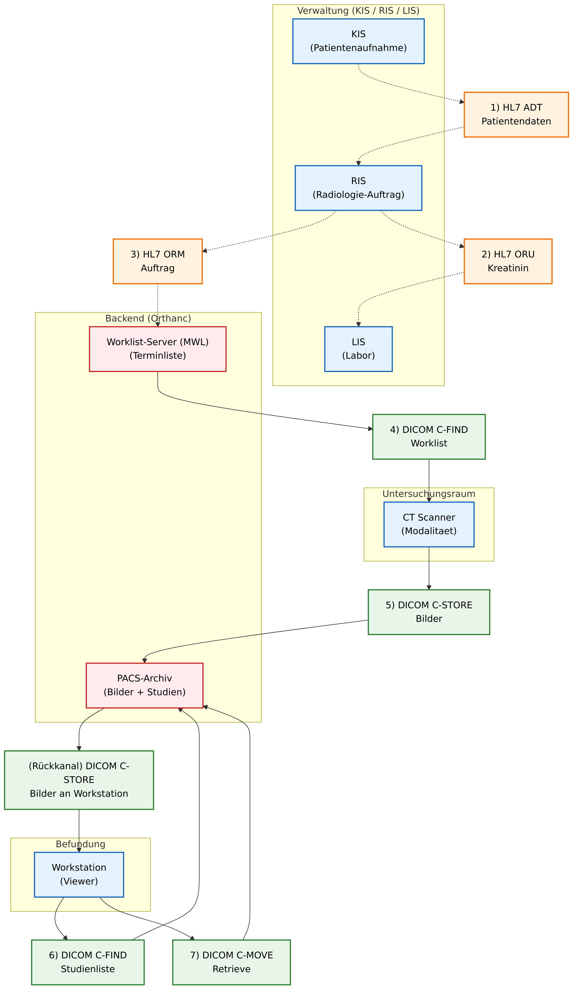

**Ziel:** Du simulierst den Datenfluss zwischen **KIS, RIS, LIS, MWL, CT, PACS und Workstation** und ordnest zu, welche Informationen über **HL7** und welche über **DICOM** übertragen werden.

# Überblick (Workflow)

{ width=100% height=15cm }

\newpage

## Systeme & Abkürzungen (kurz)

| Bereich | Kürzel / Begriff | Bedeutung | Aufgabe im Workflow |
|---|---|---|---|
| System | **KIS** | Krankenhaus-Informationssystem | Patientenaufnahme und Stammdaten |
| System | **RIS** | Radiologie-Informationssystem | Auftrag, Terminierung, Status |
| System | **LIS** | Labor-Informationssystem | Laborwerte, z.B. Kreatinin |
| System | **MWL** | Modality Worklist | Auftragsliste für Geräte |
| System | **Modalität (CT)** | Bildgebendes Gerät | Erzeugt DICOM-Bilder |
| System | **PACS** | Picture Archiving and Communication System | Bildarchiv, hier: Orthanc |
| System | **Workstation** | Viewer / Befundungsplatz | Suchen, Laden und Anzeigen von Studien |

| Standard | Kürzel | Bedeutung | Typische Funktion |
|---|---|---|---|
| **HL7** | **ADT** | Aufnahme- und Patientendaten | Patient administrativ anlegen |
| **HL7** | **ORU** | Observation Result | Laborwert/Befund übertragen |
| **HL7** | **ORM** | Order Message | Radiologie-Auftrag übertragen |
| **DICOM** | **C-FIND** | Abfrage/Suche | Worklist oder Studien suchen |
| **DICOM** | **C-STORE** | Speichern/Senden | Bilder an PACS oder Workstation senden |
| **DICOM** | **C-MOVE** | Retrieve-Anforderung | Bilder aus dem PACS anfordern |

# Vorbereitung

- App öffnen: https://orthanc.bohn-teaching.org
- Session-Kennwort eingeben (wird vom Lehrer kommuniziert)
- Optional: Workflow-Panel rechts öffnen (zeigt aktuellen und nächsten Schritt)

## Zugriff auf Orthanc (PACS)

- Zentraler Server (Standard): Orthanc ist nicht öffentlich. Der Lehrer zeigt es ggf. per Screenshare.
- Zentraler Server (optional, wenn vom Lehrer freigeschaltet): Orthanc UI unter der vom Lehrer genannten URL (Browser fragt nach einem Login, den der Lehrer vorgibt)

## SuS-PACS-Ansicht (gefiltert)

- Öffne im Simulator die Seite **/pacs** (Button: "PACS (SuS) öffnen (gefiltert)").
- Dort siehst du nur Studien, deren `PatientID` mit deinem SuS-Code beginnt, inklusive Metadaten und einfachem Viewer.

# Aufgabe 1: System-Check (DICOM C-ECHO)

1) Klicke auf **"Verbindung testen (C-ECHO)"**.
2) Beobachte die Rückmeldung.
3) Notiere:
   - Was ist C-ECHO in einem Satz?
   - Welche Komponente wird hier getestet?

# Aufgabe 2: Verwaltung (HL7) in 3 Schritten

Merksatz: **ADT = Patient**, **ORU = Labor**, **ORM = Auftrag**.

## KIS: Patient aufnehmen (HL7 ADT)

1) Trage einen Patienten ein:
   - Patientenname: z.B. `BOND^JAMES`
   - Patienten-ID (PID): z.B. `007`
2) Notiere:
   - Welche Eingaben sind Stammdaten?
   - Warum müssen sie später in DICOM-Tags wieder auftauchen?

## LIS: Kreatinin prüfen (HL7 ORU)

1) Klicke auf **"RIS → LIS: Kreatinin anfordern"**.
2) Lies Kreatinin-Wert und Status.
3) Scrolle zur angezeigten HL7-Nachricht.
4) Notiere:
   - In welchem Segment steht die PID?
   - Wo steht der Kreatininwert?
   - Was bedeutet ein hoher Wert fachlich (kurz)?

## RIS: Auftrag freigeben (HL7 ORM) + Worklist erstellen

1) Trage eine Untersuchungsbeschreibung ein (z.B. `CT Abdomen mit KM`).
2) Klicke auf **"RIS: Auftrag freigeben (HL7 ORM) + Worklist erstellen"**.

3) Beobachte:
   - Welche Auftragsnummer (Accession) wird erzeugt?
4) HL7 Analyse:
   - Finde in der angezeigten ORM-Nachricht die Segmente `PID` und `OBR`.

Beispiel (verkürzt):

```
MSH|^~\&|KIS|HOSPITAL|RIS|RADIO|...||ORM^O01|...|P|2.3
PID|||007||BOND^JAMES
ORC|NW|ACC001
OBR|1|ACC001||CT^CT Abdomen
```

# Aufgabe 3: Modalität (CT) holt Worklist (DICOM C-FIND / MWL)

1) Wechsle zur CT-Seite.
2) Klicke auf **Worklist abrufen (DICOM C-FIND)**.
3) Beobachte:
   - Welche Patientendaten kommen aus der Worklist?
   - Welche ID verknüpft Auftrag/Accession aus HL7 mit der DICOM Worklist?

# Aufgabe 4: CT-Scan (DICOM C-STORE) – echte DICOM-Dateien senden

1) Wähle einen Worklist-Eintrag aus (falls die UI das anbietet).
2) Lade echte DICOM-Dateien hoch (mehrere Dateien oder ZIP).
3) Starte den Upload/Transfer (C-STORE).
4) Beobachte:
   - Wie viele Dateien wurden gesendet?
   - Gab es "skipped" oder "failed" Dateien? Was könnte der Grund sein?

# Aufgabe 5: PACS Check – DICOM Metadaten + Viewer (gefiltert)

1) Öffne im Simulator die Seite **/pacs**.
2) Klicke bei deiner Studie auf **Metadata**.
3) Klicke auf **Viewer**, um die Bilder anzusehen.
4) Prüfe diese Tags:
   - (0010,0010) `PatientName`
   - (0010,0020) `PatientID`
   - (0008,0050) `AccessionNumber`
   - (0008,0060) `Modality`
   - (0020,000D) `StudyInstanceUID`
   - (0020,000E) `SeriesInstanceUID`
   - (0008,0018) `SOPInstanceUID`
   - (0008,0016) `SOPClassUID`
   - (0008,1030) `StudyDescription`
   - (0008,0090) `ReferringPhysicianName`
   - (0028,0010) `Rows` / (0028,0011) `Columns`
   - (0028,0100) `BitsAllocated`
   - (0002,0010) `TransferSyntaxUID`
5) Finde noch andere Tags, die man noch anschauen könnte (z.B. `ImageType`, `SeriesDescription`) und interessant wären. Konsultiere dafür die DICOM-Tag-Dokumentation (z.B. [dicom.innolitics.com](https://dicom.innolitics.com/)).

## Abgeleitete Serie: "Segmentation (simulated)"

1) Öffne in **/pacs** eine Serie deiner Studie.
2) Klicke auf **"Segmentation (simulated) erzeugen"**.
3) Prüfe danach in der Serienansicht, ob eine neue (abgeleitete) Serie entstanden ist.
4) Notiere:
   - Woran erkennst du eine neue Serie (z.B. neue `SeriesInstanceUID`, andere `SeriesDescription`)?

# Aufgabe 6: Workstation – Studien suchen (DICOM C-FIND Study Root)

1) Öffne die Workstation/Viewer-Seite.
2) Schau dir die Trefferliste an.
3) Notiere:
   - Welche Spalten siehst du (Patient, Datum, Modalität)?
   - Findest du deinen Patienten wieder?

# Aufgabe 7: Retrieve (DICOM C-MOVE) + Empfang (DICOM C-STORE Rückkanal)

1) Wähle eine Studie aus und starte **Retrieve (C-MOVE)**.
2) Warte kurz und beobachte die Empfangsliste.
3) Notiere:
   - Warum ist C-MOVE ein "Pull", führt aber zu einem "Push" über den C-STORE Rückkanal?

# Aufgabe 8: Befundung auf der Workstation (HL7 ORU^R01)

Voraussetzung: Du hast in Aufgabe 7 Bilder empfangen (C-STORE Cache ist nicht leer).

1) Öffne die Workstation-Seite.
2) Wähle im Bereich "Empfangene Studien" eine Studie aus.
3) Schreibe einen kurzen Befundtext.
4) Klicke auf **"Befund senden (HL7 ORU^R01)"**.
5) Wechsle zum Dashboard und prüfe im Block **"RIS: Befunde (aus Workstation, HL7 ORU)"**:
   - Ist ein Eintrag hinzugekommen?
   - Kannst du die HL7 Nachricht über **"HL7 anzeigen"** aufklappen?
6) Notiere:
   - Welche Patientendaten tauchen in der ORU wieder auf?
   - Wo (grob) findest du die `StudyInstanceUID` im Text?

# Aufgabe 9: Status der Untersuchung (begonnen / abgeschlossen / befundet)

Ziel: Du beobachtest im Dashboard, wie sich der **Status der Untersuchung** entlang des Workflows ändert.

1) Gehe ins Dashboard (Hauptmenü).
2) Suche in der RIS-Tabelle die Spalte **"Status Untersuchung"**.
3) Beobachte den Status nach diesen Aktionen:
   - Nach **Auftrag freigeben (HL7 ORM)**
   - Nach **Scan / Bilder senden (DICOM C-STORE)**
   - Nach **Befund senden (HL7 ORU^R01)**
4) Notiere:
   - Welche Aktion setzt welchen Status?
   - Warum können "begonnen" und "abgeschlossen" im Simulator zeitlich sehr nah beieinander liegen?
   - Welche IDs helfen dir bei der eindeutigen Zuordnung (z.B. PID, Accession, StudyInstanceUID)?

# Aufgabe 10: Fehlerfall-Training

Ziel: Ihr übt typische Situationen aus dem Alltag. Nutzt im Dashboard die Kachel **"Fehlerfälle (Training)"** oder den **Workflow-Drawer** als Checkliste.

## Fehlerfall A: Worklist ist leer

1) Geht zur CT-Seite und ruft die Worklist ab.
2) Wenn die Liste leer ist (oder ihr es provozieren wollt): Prüft, ob ihr wirklich einen Auftrag freigegeben habt (HL7 ORM).
3) Notiere:
   - Welche zwei Voraussetzungen müssen erfüllt sein, damit ein Worklist-Eintrag sinnvoll erscheint?
   - Welche Nummer ist für die Zuordnung Auftrag <-> Worklist besonders wichtig (Stichwort: Accession)?

## Fehlerfall B: C-MOVE ohne Empfang (Cache bleibt leer)

1) Startet in der Workstation ein Retrieve (C-MOVE).
2) Wenn im Cache nichts auftaucht: Wartet kurz und aktualisiert die Workstation-Seite.
3) Notiere (konzeptionell):
   - Nenne zwei plausible Ursachen, warum nach einem C-MOVE keine Bilder im Empfangs-Cache erscheinen.
   - Welche einfache Prüfung würdest du als erstes machen (z.B. C-ECHO)?

# Aufgabe 11: Reflexion

1) Ordne die Protokolle zu:
- Patient aufnehmen: ___
- Laborbefund: ___
- Auftrag: ___
- Worklist abrufen: ___
- Bilddaten senden: ___
- Studien suchen: ___
- Retrieve: ___

2) Was war für dich neu oder überraschend?
